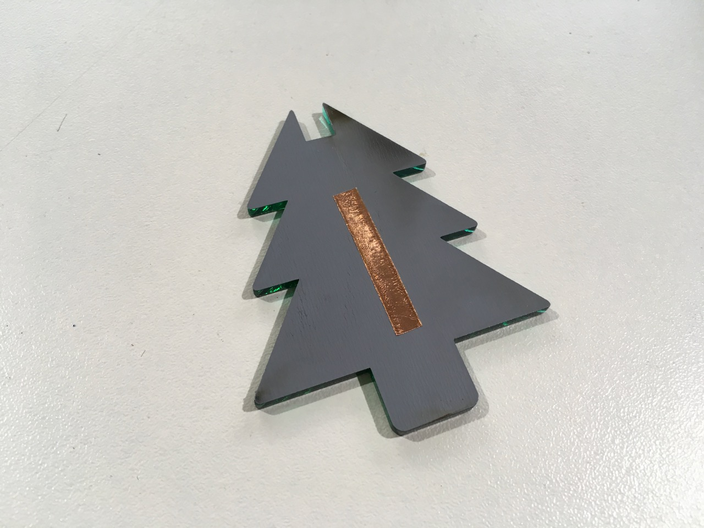
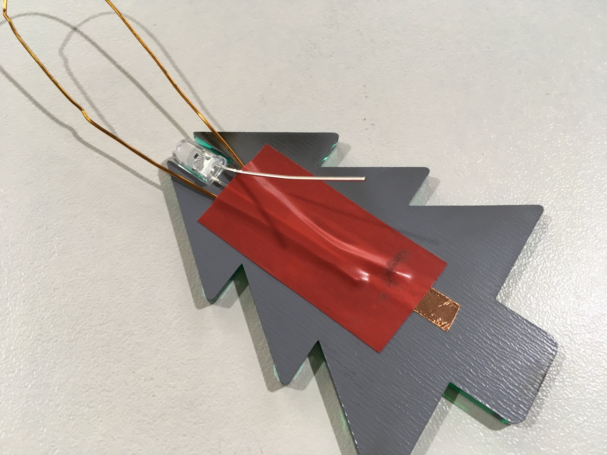

# Christmas tree

## Step 1

Remove any remaining film from the front of your **laser cut tree**.

## Step 2

Carefully wipe both sides of the tree with a **clean, damp cloth**.

Notice how your tree has a back (the dull, grey side) and a front (the mirrored, coloured side).

## Step 3

Cut about **4cm of copper tape** (0.5cm wide) and place it down the centre of the back of the tree.

## Step 4

Place the **LED** into the slot at the top of the tree, with the _shorter leg on the left_ and the little arrow inside the bulb _pointing to the right_.

## Step 5

Carefully bend the longer leg upwards out of the way, temporarily.

## Step 6

Grab **10–15cm of string**, and hold it in place, forming a U-shaped loop, from one side of the copper tape to the other.

Then place **insulation tape** over the short leg and the string, leaving some of the bottom of the copper tape exposed.

## Step 7

Bend the longer leg back down, so it’s straight and resting on top of the insulation tape.

## Step 8

Cut a piece of **double sided mounting tape**, big enough to cover the back of the battery holder, and stick it onto the **back of the battery holder**, and peel off the backing paper.

## Step 9

Then stick the battery holder down over the circuit and string, so that:

1. The ⊕ symbol on the battery holder is at the top right
2. The battery holder’s top terminal touches the long leg of the LED
3. And the battery holder’s bottom terminal touches the exposed copper tape

## Step 10

Secure the two battery terminal holders into place with **a dab of solder**.

The soldering iron will get very hot during operation, so to prevent damage to the battery, we recommend removing it from the holder while you’re soldering. You can put the battery back in once you’re done.

## Step 11

Decorate your tree!

